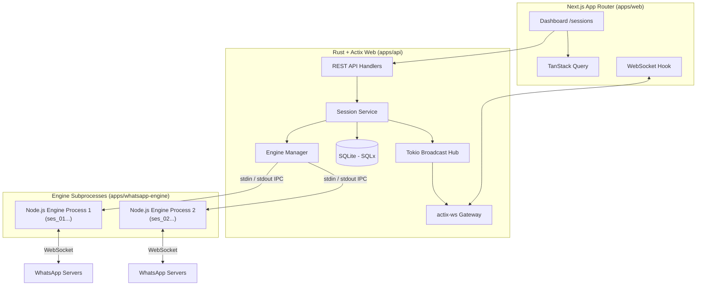

# Architecture Specification

## Overview Diagram

## Component Boundaries

### 1. Next.js Dashboard (`apps/web`)
- Provides UI for session management, connection state monitoring, QR display, and pairing code input.
- Receives realtime state events via WebSocket to invalidate TanStack Query cache.

### 2. Rust Actix Backend (`apps/api`)
- Authoritative application layer.
- Manages session records in SQLite database (`sessions` table).
- Controls session state machine transitions.
- Manages lifecycle of Node.js engine child processes (`tokio::process::Command`).
- Broadcasts session state changes over WebSocket.

### 3. WhatsApp Engine (`apps/whatsapp-engine`)
- Node.js runtime process executed per session.
- Runs `@whiskeysockets/baileys` to communicate with WhatsApp Web servers.
- Receives JSON-line commands on `stdin` (`engine.start`, `engine.stop`, `engine.request_pairing_code`).
- Emits JSON-line events on `stdout` (`session.qr`, `session.ready`, `session.disconnected`, etc.).
- Persists auth material to `data/sessions/{session_id}/auth/`.
