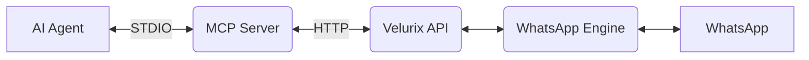

# Velurix ReachOut Automation MCP Server Guide

## Architecture

The MCP (Model Context Protocol) Server acts as a bridge between AI Agents and the Velurix REST API, allowing AI agents to securely interact with the WhatsApp automation engine.



## Installation

To build the MCP server:

```bash
cd apps/mcp-server
npm install
npm run build
```

## Configuration

Environment variables:
- `VELURIX_API_URL` — Backend API URL (default: `http://localhost:8080/api/v1`)
- `VELURIX_API_KEY` — API authentication key

## MCP Client Configuration

### Antigravity (`.gemini/settings.json`)

```json
{
  "mcpServers": {
    "velurix-reachout": {
      "command": "node",
      "args": ["c:/client/reachout-automation2.0/apps/mcp-server/dist/index.js"],
      "env": {
        "VELURIX_API_URL": "http://172.21.92.41:8080/api/v1",
        "VELURIX_API_KEY": "your-api-key-here"
      }
    }
  }
}
```

### Claude Desktop (`claude_desktop_config.json`)

```json
{
  "mcpServers": {
    "velurix-reachout": {
      "command": "node",
      "args": ["c:/client/reachout-automation2.0/apps/mcp-server/dist/index.js"],
      "env": {
        "VELURIX_API_URL": "http://172.21.92.41:8080/api/v1",
        "VELURIX_API_KEY": "your-api-key-here"
      }
    }
  }
}
```

### Hermes Agent

For Hermes agent, configure it similarly by pointing the MCP server command to the compiled `index.js` file and providing the necessary environment variables. The Hermes agent will automatically load all the exported tools and make them available to its AI models.

## Complete Tool Reference

The MCP Server exposes 49 tools across several categories.

### 1. Session Management
- **list_sessions**: List all active WhatsApp sessions.
- **create_session**: Create a new WhatsApp session.
- **get_session**: Get details for a specific session.
- **delete_session**: Delete a session.
- **start_session**: Start a session engine.
- **stop_session**: Stop a session engine.
- **restart_session**: Restart a session engine.

### 2. WhatsApp Login
- **login_whatsapp**: Request a login for a session. Returns a QR code image.
- **check_login_status**: Check the status of a login request.
- **request_pairing_code**: Request a pairing code for login instead of a QR code.

### 3. Messaging
- **send_whatsapp_text**: Send a plain text message.
- **send_whatsapp_media**: Send a message with media attached.
- **validate_phone_numbers**: Check if phone numbers are registered on WhatsApp.

### 4. Contacts
- **list_contacts**: List contacts from a session.
- **search_contacts**: Search for specific contacts.
- **sync_contacts**: Force a synchronization of contacts.
- **get_profile_picture**: Retrieve a contact's profile picture.

### 5. Chats
- **list_chats**: List recent chats.
- **get_chat_messages**: Retrieve messages for a specific chat.
- **sync_chats**: Force a synchronization of chats.
- **mark_chat_read**: Mark a chat as read.

### 6. Campaigns
- **list_campaigns**: List all campaigns.
- **get_campaign**: Get details of a specific campaign.
- **create_campaign**: Create a new campaign.
- **update_campaign**: Modify a campaign.
- **delete_campaign**: Delete a campaign.
- **clone_campaign**: Clone an existing campaign.
- **start_campaign**: Start campaign execution.
- **pause_campaign**: Pause campaign execution.
- **stop_campaign**: Stop campaign execution.
- **retry_failed_recipients**: Retry failed messages in a campaign.
- **import_recipients**: Import recipients for a campaign.
- **export_campaign_results**: Export campaign results.

### 7. Recipients & Logs
- **list_campaign_recipients**: List all recipients for a campaign.
- **update_campaign_recipient**: Update a recipient's details.
- **list_campaign_logs**: Retrieve execution logs for a campaign.

### 8. Blacklist
- **get_blacklist**: Retrieve the global blacklist.
- **add_to_blacklist**: Add a number to the blacklist.
- **remove_from_blacklist**: Remove a number from the blacklist.

### 9. Templates
- **list_templates**: List message templates.
- **get_template**: Get template details.
- **create_template**: Create a new template.
- **update_template**: Modify an existing template.
- **delete_template**: Delete a template.

### 10. Smart Composite
- **send_campaign_message**: Send a message via campaign system.
- **send_bulk_messages**: Send bulk messages.
- **create_and_start_campaign**: Create and immediately start a campaign.
- **get_campaign_dashboard**: Get campaign metrics dashboard.
- **full_system_status**: Retrieve the overall system status.

## QR Code Login Walkthrough

This shows how an AI agent can log a session into WhatsApp:

1. Agent calls `login_whatsapp` for a session ID.
2. The MCP server returns a base64 PNG of the QR code. The agent can display this to the user.
3. The user scans the QR code with their WhatsApp mobile app.
4. Agent polls `check_login_status` every 3 seconds to monitor the process.
5. Status transitions are monitored: `STARTING` → `QR_CODE` → `CONNECTED`. Once `CONNECTED`, the session is ready.

## Resources Reference
The MCP server exposes these resources:
- `reachout://sessions/status` - Current status of all sessions
- `reachout://campaigns/active` - Active campaigns running
- `reachout://system/health` - Overall system health metrics

## Prompts Reference
- `campaign-wizard`: Helps users create new campaigns step-by-step
- `troubleshoot-session`: Analyzes session logs to resolve connectivity issues
- `daily-report`: Generates a summary of campaign performance

## Error Code Reference

| Code | HTTP Status | Description |
|------|------------|-------------|
| DATABASE_ERROR | 500 | Internal database error |
| SESSION_NOT_FOUND | 404 | Session ID does not exist |
| SESSION_ALREADY_RUNNING | 409 | Session engine is already active |
| INVALID_STATE_TRANSITION | 409 | Cannot transition between states |
| VALIDATION_ERROR | 400 | Input validation failed |
| SESSION_NOT_READY | 409 | Session not in connected state |
| ENGINE_NOT_AVAILABLE | 502 | WhatsApp engine unreachable |
| ENGINE_TIMEOUT | 504 | Engine operation timed out |
| UNAUTHORIZED | 401 | Invalid or missing API key |
| CAMPAIGN_NOT_FOUND | 404 | Campaign ID does not exist |
| TEMPLATE_NOT_FOUND | 404 | Template ID does not exist |
| BLACKLIST_ERROR | 400 | Blacklist operation failed |
| IMPORT_ERROR | 400 | Recipient import failed |
| EXPORT_ERROR | 400 | Campaign export failed |

## Testing

To test the MCP server using the MCP Inspector:

```bash
npx @modelcontextprotocol/inspector node apps/mcp-server/dist/index.js
```
